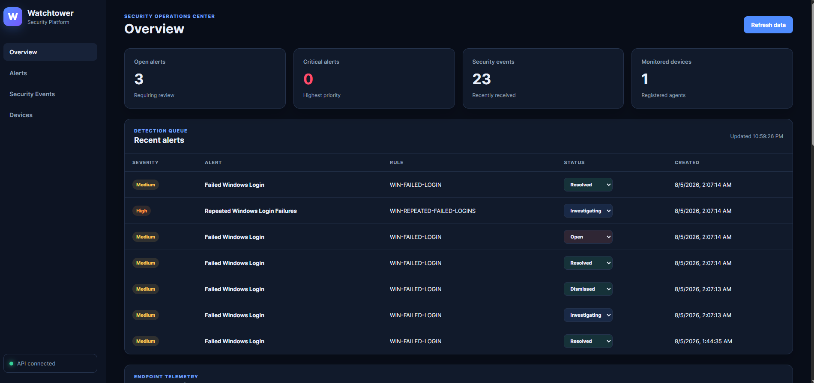
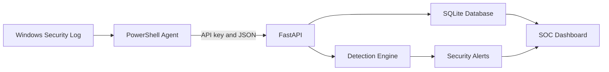

# Watchtower Security Platform

Watchtower is a Windows security-monitoring and incident-response platform built with PowerShell, Python, FastAPI, SQLAlchemy, SQLite, and JavaScript.

A PowerShell endpoint agent collects selected Windows Security events and sends them to an authenticated API. Watchtower stores the events, evaluates configurable detection rules, creates security alerts, and presents the results through a responsive SOC dashboard.

## Dashboard



## Features

- Authenticated Windows agent registration
- Windows Security Event Log collection
- API-key-protected event ingestion
- SQLite event, device, and alert storage
- Duplicate-event prevention
- JSON-based detection rules
- Immediate event detections
- Threshold and time-window correlation
- Alert severity classification
- Analyst alert-status management
- Live SOC dashboard
- Agent state tracking
- Safe failed-login simulation
- Automated API and detection tests
- GitHub Actions continuous integration

## Architecture



## Example Detections

| Event ID | Detection | Severity |
|---|---|---|
| 4625 | Failed Windows login | Medium |
| 4720 | Windows account created | High |
| 4726 | Windows account deleted | High |
| 4732 | Member added to local security group | High |
| 1102 | Windows Security log cleared | Critical |
| 4625 threshold | Five failures within ten minutes | High |

## Technology Stack

- PowerShell
- Python
- FastAPI
- SQLAlchemy
- SQLite
- HTML, CSS, and JavaScript
- Pytest
- GitHub Actions

## Local Setup

### 1. Create the Python environment

```powershell
python -m venv .venv
Set-ExecutionPolicy -Scope Process -ExecutionPolicy Bypass
.\.venv\Scripts\Activate.ps1
```

### 2. Install dependencies

```powershell
python -m pip install -r requirements.txt
```

### 3. Create the API environment file

Copy the example:

```powershell
Copy-Item .env.example .env
```

Generate an API key:

```powershell
python -c "import secrets; print(secrets.token_urlsafe(32))"
```

Place the generated value in `.env`:

```text
WATCHTOWER_AGENT_API_KEY=your-generated-key
```

Do not commit `.env`.

### 4. Configure the Windows agent

Copy the example configuration:

```powershell
Copy-Item agent\agent-config.example.json agent\agent-config.json
```

Update these values inside `agent-config.json`:

- `device_id`
- `api_key`
- `lookback_minutes`
- `api_base_url`, if the API is on another computer

The agent key must exactly match the value in `.env`.

### 5. Start the API

```powershell
python -m uvicorn backend.main:app --reload
```

The API documentation is available at:

```text
http://127.0.0.1:8000/docs
```

The SOC dashboard is available at:

```text
http://127.0.0.1:8000/dashboard
```

## Running the Windows Agent

Reading the Windows Security log generally requires an elevated PowerShell session.

Open PowerShell as Administrator, navigate to the project, and run:

```powershell
Set-ExecutionPolicy -Scope Process -ExecutionPolicy Bypass
.\agent\Watchtower-Agent.ps1
```

The agent will:

1. Register the Windows device.
2. Read configured Security Event IDs.
3. Ignore records it previously processed.
4. Send new events using the API-key header.
5. Update its local state file.

## Running the Safe Simulation

The simulation submits five labeled test events to the local API. It does not attempt real logins or modify Windows.

```powershell
.\simulations\Send-FailedLoginBurst.ps1
```

Watchtower should create medium alerts for the individual failures and a high-severity correlation alert when the threshold is reached.

## Running Tests

```powershell
python -m pytest -v
```

The automated suite verifies:

- Unauthorized agents are rejected.
- Authorized devices can register.
- Duplicate security events are not stored twice.
- Failed logins generate alerts.
- Five failures within ten minutes trigger correlation.

Tests use temporary databases and do not modify the local `watchtower.db`.

## Security Considerations

- Real API keys are excluded through `.gitignore`.
- API keys are compared using constant-time comparison.
- Agent configuration and state are excluded from version control.
- Event data is escaped before dashboard rendering.
- GitHub Actions uses read-only repository permissions.
- The current SQLite configuration is intended for local development and demonstration.

## Project Structure

```text
watchtower-security-platform/
├── .github/workflows/
├── agent/
├── backend/
│   └── routes/
├── dashboard/
├── detection_rules/
├── simulations/
├── tests/
├── .env.example
├── .gitignore
├── README.md
└── requirements.txt
```

## Future Improvements

- PostgreSQL support
- Docker deployment
- Analyst authentication and role-based access control
- Incident notes and audit history
- Additional correlation rules
- Agent heartbeat and offline-device detection
- Azure deployment